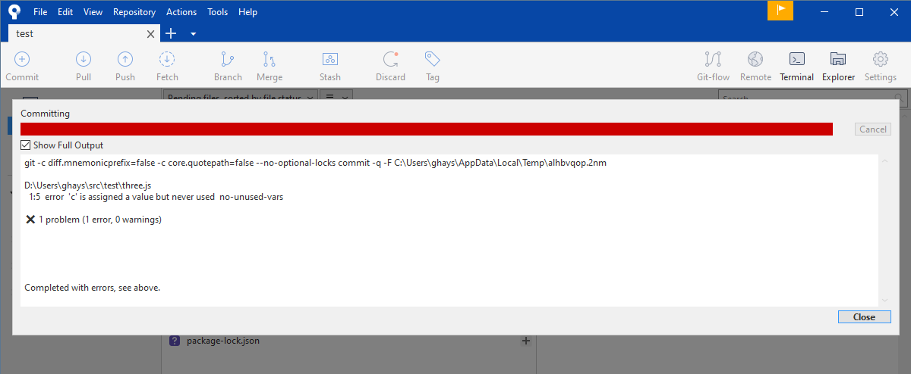

# Test Repo

Test repository for trying out new features and concepts.

## Git Hooks

The `run-eslint.sh` git hook is triggered and visible in Sourcetree.



## ESLint

To get around the requirement for an `.eslintrc.*` run with the no-config switch. Also, if there are JavaScript files with an extension other than `.js` the ext switch can be used.

```
  --no-eslintrc                   Disable use of configuration from .eslintrc.*
  --ext [String]                  Specify JavaScript file extensions
```
